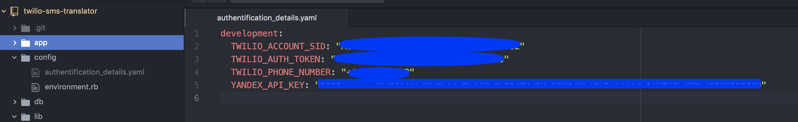

# Twilio SMS Translator

The Twilio SMS Translator web application translates your Twilio SMS messages from English to your choice of more than 90 languages.

### Prerequisites
* Twilio account
* Twilio credit
    * Sign up for a Twilio account using the following link to receive $10 in free Twilio credits: www.twilio.com/referral/Io05rI
* Twilio phone number
* Yandex Translate API key
* Personal cell phone number for application testing (text messaging rates may apply)
    > Verify number
    > * Log into your Twilio account.
    > * Go to phone numbers -> Verified Caller IDs -> click the "+" symbol to add your personal cell phone number.
    > * Follow steps for verification.

### Getting Started

  Create a YAML file to store your credentials and secrets.
    app -> config -> create new file (authentification_details.yaml)
    

## Deployment

While in your root directory, run 'rackup' to launch server.

## Built With

* Ruby
* Sinatra - The web framework used
* Twilio API
* Yandex Translator API

## Author

**Amee Covarrubias** - *Student at Hackbright Academy Engineering School for Women*

## License

This project is licensed under the MIT License - see the [LICENSE.md](LICENSE.md) file for details
